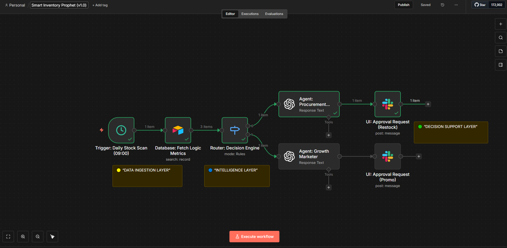

# 🔮 Smart Inventory Prophet (v1.0)

> **"Don't just track stock; predict it." An Operational Intelligence system that uses Math & AI to autonomously manage Procurement and Clearing Dead Stock.**

## 🚨 The Problem: "Silent Assumptions"
In e-commerce, seeing "50 units in stock" is a dangerous illusion.
* **The Velocity Trap:** If sales speed triples overnight, those 50 units might last only 2 days, not 2 weeks. Static alerts fail to catch this.
* **Dead Capital:** Conversely, products that haven't moved in 120 days occupy valuable warehouse space and tie up cash flow.
* **The Result:** Businesses react too late, leading to either **Revenue Loss (Stockouts)** or **Dead Capital (Overstock).**

## ✅ The Solution: Layered AI Architecture
This is not a simple alert bot. It is a **"Layered Intelligence"** system that acts as a digital Operation Manager.
Using advanced Airtable formulas, it calculates **"Days of Cover"** (Real-time Stock Life). Based on math, it routes the problem to the correct AI Agent:
1.  **Procurement Agent:** If stock is running low based on lead time, it drafts a reorder email to the supplier.
2.  **Growth Marketer Agent:** If stock is "dead," it writes a FOMO-induced marketing campaign to liquidate it.

**The Manager's Role:** You simply click "Approve" on Slack. No manual writing, just strategic decision-making.

## 🛠 Tech Stack & Architecture

| Component | Role |
|-----------|------|
| **Airtable (Logic Layer)** | Calculates derived metrics like `Velocity`, `Days_of_Cover`, and `Lead_Time_Deviation`. |
| **n8n (Orchestrator)** | Manages the decision tree (Router) and executes the workflow. |
| **OpenAI (Dual Personas)** | **Agent A (Buyer):** Professional negotiation tone. **Agent B (Marketer):** Persuasive sales copy. |
| **Slack Block Kit** | The "Human-in-the-loop" interface for final approval. |

## ⚙️ Workflow Logic

### 1. Data Ingestion Layer (The Math)
* The system pulls real-time inventory data.
* It doesn't look at "Quantity"; it calculates **Time**.
* *Formula:* `Current Stock / Daily Sales Velocity = Days to Stockout`.

### 2. Intelligence Layer (The Router)
The workflow splits into two paths based on the math:
* **Path A (Danger Zone):** If `Days to Stockout < Supplier Lead Time` → Trigger **Procurement Agent**.
* **Path B (Dead Zone):** If `Last Sale Date > 120 Days` → Trigger **Growth Marketer Agent**.

### 3. Decision Support Layer (The Action)
* The AI generates the perfect email or campaign text.
* It sends a **Decision Card** to Slack.
* Manager clicks "Approve" → Action is executed (Email sent / Campaign drafted).

## 🚀 How to Use

1.  Import the `workflow.json` into n8n.
2.  Set up the **Airtable Base** with columns: `Stock`, `Velocity`, `Lead_Time`, `Last_Sale`.
3.  Configure **OpenAI API** with GPT-4o.
4.  Connect **Slack** for notifications.
5.  Let the math run your warehouse!

---

### 👤 Author
**Emrah Digital** - *Operational Intelligence Solutions*
[Visit my Website](https://emrahdemirkoc.com)
